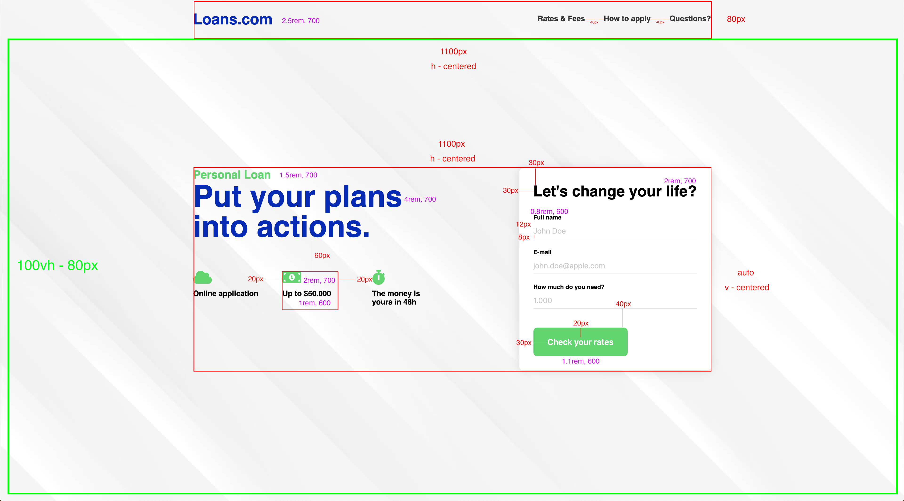

# Zaawansowany HTML i CSS - egzamin

## Wytyczne dotyczące githuba

1. Stwórz [*fork*](https://guides.github.com/activities/forking/) repozytorium z zadaniami.
2. Sklonuj repozytorium na swój komputer. Użyj do tego komendy `git clone adres_repozytorium`
Adres repozytorium możesz znaleźć na stronie repozytorium po naciśnięciu w guzik "Clone or download".
3. Rozwiąż zadania i skomituj zmiany do swojego repozytorium. Użyj do tego komend `git add nazwa_pliku`.
Jeżeli chcesz dodać wszystkie zmienione pliki użyj `git add .` 
Pamiętaj że kropka na końcu jest ważna!
Następnie skommituj zmiany komendą `git commit -m "nazwa_commita"`
4. Wypchnij zmiany do swojego repozytorium na GitHubie.  Użyj do tego komendy `git push origin master`
5. Stwórz [*pull request*](https://help.github.com/articles/creating-a-pull-request) do oryginalnego repozytorium, gdy skończysz wszystkie zadania.

## Uwagi dotyczące rozwiązywania zadań

Zadania te są testowane za pomocą **specjalnych testów automatycznych**. Zwróć zatem uwagę na następujące rzeczy:
* wcięcia w kodzie,
* nie używaj polskich znaków, staraj się używać języka angielskiego,
* zawsze sprawdzaj, czy Twoje rozwiązanie działa, jeśli powoduje ono błędy nie zostanie ocenione. W takim wypadku lepiej zakomentuj **wrażliwe** części.

---
## Zadanie 1 **(20 pkt)**

> Zadanie wykonuj w plikach:  
> `index.html`  
> `css/style.css`


Twoim zadaniem jest stworzyć langing page dotyczący pożyczek. Strona składa się z dwóch sekcji:
- logotyp z nawigacją (`.header`)
- część główna (`.main`) podzielona na:
  - opis (`.into__info`)
  - formularz (`.intro__form`)
  
Całość strony powinna mieścić się w 100% wysokości przeglądarki.  
  
#### Logotyp z nawigacją
Należy stworzyć do tej części konstrukcję w HTML. W pliku `index.html` znajduje się miejsce w którym należy umieścić kod HTML dla całego nagłówka. Oto wytyczne:

- logotyp ma być linkiem,
- lista nawigacji ma zostać stworzona za pomocą elementów `nav`, `ul`, `li` i `a`. Każdy jej element ma być klikalny.  
  
#### Część główna
Część główna powinna być wycentrowana w pionie i w poziomie względem całego okna.  

#### Ikony w części głównej
Są to ikony "Font Awesome". W `head` strony należy umieścić odpowiednie style odpowiedzialne za ten font:
```html
<link rel="stylesheet" href="https://cdnjs.cloudflare.com/ajax/libs/font-awesome/5.9.0/css/all.min.css"/>
```
Ikony te mają być dodane za pomocą **pseudoelementów** do klas `.icons__item`. **Nie należy dodawać tym elementom żadnych dodatkowych klas ani ID w celu dodania ikon!** Należy wykorzystać inne znane Ci metody.

Pseudoelementy te muszą mieć ustawiony `font-weight` na `bold`, `font-family` na `"Font Awesome 5 Free"` i `content` kolejno na: 
- `"\f0c2"`
- `"\f3d1"`
- `"\f2f2"`

#### Ogólne wytyczne
Przyjrzyj się również obrazkowi poniżej, będzie Ci łatwiej zrozumieć polecenia. Staraj się odwzorować ten template zgodnie z wytycznymi:

* do projektu należy dołączyć `reset` lub `normalize`
* użyty font to Montserrat (należy go dodać za pomocą Google Fonts) w wariantach: 400, 600, 700
* kolory użyte w projekcie (należy skorzystać ze zmiennych CSS3): 
```css
:root {
  --main-color: rgb(1, 36, 186);
  --accent-color: rgb(9, 216, 98);
  --text-color: rgb(53, 53, 53);
}
``` 
* zaokrąglenia (jeżeli występują) wynoszą `8px`
* tło znajduje się w folderze `images/background.jpg`
  - powinno być wycentrowane, nie powtarzające się, dopasowane do `body`
* należy użyć klasy `container` do ograniczenia szerokości i wycentrowania treści 
* sekcja `.intro__form` posiada cień o rozmyciu na poziomie `20px` i kolorze `rgba(0, 0, 0, .13)`

#### Layout wraz z planem - `images/layout-plan.jpg`

- czerwone linie mówią o odległościach pomiędzy elementami albo ich wielkości
- fioletowe napisy odnoszą się do wielkości i grubości fonta


### Źródła
- Layout: https://dribbble.com/shots/5982586-Personal-Loan-Landing-page-concept by [Renato Stefani Filgueiras](https://dribbble.com/renatosf)
- Tło: [Background vector created by starline - www.freepik.com](https://www.freepik.com/free-photos-vectors/background)