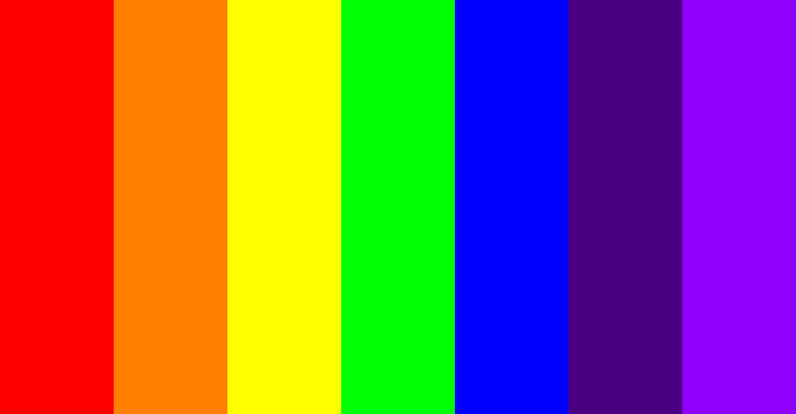

# __Sass i RWD - egzamin__

## Wytyczne

1. Stwórz [*fork*](https://guides.github.com/activities/forking/) repozytorium z zadaniami.
2. Sklonuj repozytorium na swój komputer. Użyj do tego komendy `git clone adres_repozytorium`
Adres repozytorium możesz znaleźć na stronie repozytorium po naciśnięciu w guzik "Clone or download".
3. Rozwiąż zadania i skomituj zmiany do swojego repozytorium. Użyj do tego komend `git add nazwa_pliku`.
Jeżeli chcesz dodać wszystkie zmienione pliki użyj `git add .` 
Pamiętaj że kropka na końcu jest ważna!
Następnie skommituj zmiany komendą `git commit -m "nazwa_commita"`
4. Wypchnij zmiany do swojego repozytorium na GitHubie.  Użyj do tego komendy `git push origin master`
5. Stwórz [*pull request*](https://help.github.com/articles/creating-a-pull-request) do oryginalnego repozytorium, gdy skończysz wszystkie zadania.

## Uwagi

* Zadania rozwiązuj w odpowiednich plikach w katalogu ```partials``` (np.: ```partials/_zadanie01.scss```).
* Masz już gotowy plik ```main.scss``` importujący wszystkie zadania.
* Wynik kompilacji pliku __sass/main.scss__ zapisz do pliku __css/main.css__ - nie zmieniaj ułożenia folderów i plików!
:boom: :boom: :boom:

### Pamiętaj, że zadanie jest __niezaliczone__ jeżeli nie zastosujesz się do poleceń! :bomb: :bomb: :bomb:
### Jeśli pliki Sassowe nie skompilują się, to egzamin jest __niezaliczony__!
### Jeśli coś Ci nie działa - zakomentuj kod, którego nie jesteś pewien.

---------------------------------------------------------------------

## Zadanie 1
(1 pkt)

Stwórz podstawowy reset CSS ```scss/partials/_zadanie01.scss```

## Zadanie 2
(2 pkt)

Zdefiniuj za pomocą Sass mapę o nazwie ```rainbow```, która będzie miała w sobie __7 par klucz-wartość__, a każda wartość odpowiada innemu kolorowi tęczy. Użyj kolorów podanych poniżej (ważne -  niech nazwy kolorów i wartości będą __dokładnie__ takie jak w przykładzie poniżej):

    - Red: #FF0000
    - Orange: #FF7F00
    - Yellow: #FFFF00
    - Green: #00FF00
    - Blue: #0000FF
    - Indigo: #4B0082
    - Violet: #8F00FF


__Pamiętaj: Mapa powinna mieć nazwę ```rainbow```__

## Zadanie 3
(3 pkt)

 __Przy pomocy Sassa__ utwórz wszystkie klasy potrzebne aby zrobić swój własny grid. Zakładamy, że grid przyjmuje układ 7-kolumnowy oraz główny kontener posiada ```100%``` szerokości. Klasy związane z szerokością elementu nazwij ```.col-X``` - na przykład ```.col-1```, ```.col-2``` ... ```.col-7```.
Nie zapominaj o klasach ```container``` oraz ```row```.

## Zadanie 4
(2 pkt)
Ustaw wysokości i szerokośći wszystkich sekcji:
- Elementy o klasie ```section-1``` oraz ```section-3``` powinny mieć __1000px__ wysokości i całą dostępną szerokość,
- Element o klasie ```section-2``` powinien zajmować __całą wysokość i całą szerokość__ okna przeglądarki.

## Zadanie 5
(4 pkt)

 W sekcji o klasie ```section-1``` stwórz tęczę jak na załączonym obrazku poniżej. Szerokość kontenera z tęczą ustaw na 1000px. Każdy element tęczy powinien mieć również __1000px__ wysokości.
 
__Wykorzystaj:__
 - Mapę z __Zadania 2__ do pokolorowania tęczy. Skorzystaj z pętli do ustawienia kolorów dla każdej kolumny.
 - Klasy z __Zadania 3__ do pozycjonowania elementów.




## Zadanie 6
(4 pkt)

Stwórz mixin o nazwie ```arrow```. Mixin powinien przyjmować __3__ parametry ```$color```, ```$direction```, ```$size```.
Celem mixina jest stworzenie strzałki o zadanym kolorze, kierunku i wielkości.
Niech wywołanie mixina będzie następujące:

```CSS
@include arrow(red, top, 15px);
```

lub 

```CSS
@include arrow(blue, bottom, 15px);
@include arrow(red, left, 15px);
@include arrow(red, right, 15px);
```

__Wskazówki:__ 
* nie używaj pseudoelementów 
* nazwa mixina to ```arrow```, nie zmieniaj jej!
* niech kolejność parametrów będzie taka jak w przykładzie wywołania ($color, $direction, $size)

## Zadanie 7
(4 pkt)

 W sekcji o klasie ```section-3``` znajduje się obrazek. Ustaw tej sekcji ```1000px``` wysokości (jeśli nie zostało to zrobione w __Zadaniu 4__). Następnie opisz odpowiednie warunki tak aby:
* Gdy ekran ma ```1025px``` szerokości lub więcej obraz miał ```600px``` szerokości i był __idealnie na środku sekcji__ (w pionie i poziomie),
* Gdy ekran ma między ```768px``` a ```1024px``` szerokości (włączając w to wymienione wartości) to obrazek miał ```200px``` szerokości i był w __prawym górnym rogu sekcji__,
* Gdy ekran ma ```767px``` szerokości lub mniej to obrazek ma __całą dostępną szerokość__ sekcji.


Pamiętaj, aby obrazek zawsze miał __zachowane proporcje__ (nie może być rozciągnięty w pionie lub w poziomie)!
Korzystaj tylko z flexboxa!

## __Powodzenia!__ :star: :smile: :+1:
