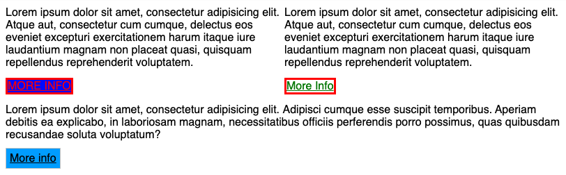

# CSS - Kaskadowe arkusze stylów


## Zadania rozwiązywane z wykładowcą

### Zadanie 0a

> Zadanie wykonuj w plikach:  
> `css/style0a.css`   
> `index0a.html`


Stwórz jeden **paragraf**, ustaw dla niego poniższe style i przetestuj ich działanie.

```css
p {
  font-size: 12px;
}

p {
  font-size: 40px;
}
```


## Zadania do samodzielnego wykonania

### Zadanie 1

> Zadanie wykonuj w plikach:  
> `css/style01.css`   
> `index01.html`

W arkuszu styli, ustawione są style dla elementu o klasie `.more-info` oraz `.btn`, ale są one przesłonięte przez **specificity**.

Popraw selektory tak aby style zadziałały.

**Efekt końcowy:**


---

###  Zadanie 2 

> Zadanie wykonuj w plikach:  
> `css/style02.css`   
> `index02.html`

Stwórz dwa **paragrafy** oraz jeden element **span** i wszystkim elementom ustaw tło w kolorze żółtym (```yellow```). Możesz to zrobić w dowolnie wybrany przez siebie sposób.

---

###  Zadanie 3 

> Zadanie wykonuj w plikach:  
> `css/style03.css`   
> `index03.html`

Na stronie znajdują się 2 linki. Jeden na górze w formie tekstu, drugi na dole przypominający button. Button na dole ma błędny kolor tekstu (powinien być biały). Z czego to wynika? **Spróbuj naprawić ten problem**.

Dla tytułu w tekście zmień kolor na `#FC0031`.