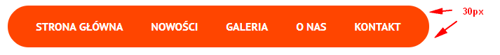
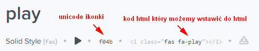
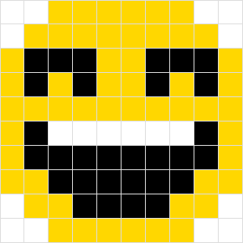

# CSS - Zaawansowane selektory

## Zadania rozwiązywane z wykładowcą

### Zadanie 0a

> Zadanie wykonuj w plikach:  
> `index0a.html`  
> `css/style0a.css` 

Klient zażyczył sobie, by narożniki menu były zaokrąglone. Ustaw więc pierwszemu i ostatniemu elementowi menu zaokrąglenie o wielkości **30px** na róg.

Pamiętaj, że `border-radius` podajemy w kierunku wskazówek czyli kolejno narożniki: `top-left top-right bottom-right bottom-left`.

Dodatkowo dla piewszego `li` dodaj padding z lewej strony o wielkości `40px`, a dla ostatniego elementu `li` ten sam padding z prawej strony.

Wynik powinien być jak na poniższej grafice:

## Zadania do samodzielnego wykonania

### Zadanie 1

> Zadanie wykonuj w plikach:  
> `index01.html`  
> `css/style01.css` 

Klient narzeka, że tabela nie jest czytelna - i ma rację.

Popraw jej wygląd poprzez:
- dla komórek `td` tabeli daj **padding** ustawiony na **20px**
- zrób z tabeli zebrę, czyli dla co drugiego rzędu w ciele tabeli ustaw kolor tła na **#eee**

---

### Zadanie 2

> Zadanie wykonuj w plikach:  
> `index02.html`  
> `css/style02.css` 

Na stronie znajdują się 2 rzędy przycisków.
Wykorzystują one https://fontawesome.com/ czyli bardzo popularne w internecie ikony wektorowe.

Gdy zbadasz narzędziami developera górny rząd przycisków, zobaczysz, że ikony są wstawione do buttonów jako elementy `<i>`.
Nie zawsze będziesz miał taką możliwość - dla przykładu html będzie generowany przez zewnętrzny plugin i nie będziesz mieli wpływu co zostanie wygenerowane.

Twoim zadaniem będzie w dolnym rzędzie (`buttons-ver-2`) zrobienie takich samych buttonów z ikonami, ale bez wstawiania do buttonów żadnych dodatkowych znaczników. Musisz więc wykorzystać tutaj pseudoelementy **:before**.
Korzystając z wyszukiwarki na stronie: https://fontawesome.com/icons?d=gallery wyszukaj następujące ikony: **plus-circle**, **ban** i **play-circle**.

Gdy wejdziesz na którąkolwiek z tych ikon, pojawi Ci się jej strona. Na górze strony tuż pod nazwą ikony masz pokazany html, który możesz wkleić do html by uzyskać daną ikonę (tak jak jest to zrobione w górnym rzędzie buttonów). 

Tuż obok znajduje się kod unicode, który możesz wykorzystać przy pseudoelementach. 

 
Wystarczy wstawić go do właściwości content poprzedzając tą wartość ukośnikiem czyli **content: "\f04b";**. Żeby tak wstawiona ikonka zadziałała, dany pseudoelement powinien też mieć ustawiony `font-family` na "Font Awesome 5 Free".

Wiedząc to spróbuj ostylować 3 dolne przyciski tak by wyglądały identycznie jak te powyżej.

Stylując dolne przyciski po ich klasach dla każdego z nich wstaw:
- odpowiedni unicode pobrany z podstron danych ikonek
- `font-family` ustawiony na "Font Awesome 5 Free"
- wielkość tekstu na `1.5em`

---

### Zadanie 3

> Zadanie wykonuj w plikach:  
> `index03.html`  
> `css/style03.css` 

Na stronie znajduje się plansza **.cnt**. Twoim zadaniem będzie takie ostylowanie tej planszy, by uzyskać efekt jak na poniższej grafice:

W zadaniu **nie wolno używać klas i identyfikatorów**. Cała reszta jest dowolna. Liczy się efekt.
W tym zadaniu bardzo dobrze jest posiłkować się debugerem, dzięki czemu będziesz mógł sprawdzić jakiego typu jest dany kwadracik.
---

### Zadanie 4

Zagraj w grę [flukeout.github.io](http://flukeout.github.io/) (Poziomy od 15 do 26).