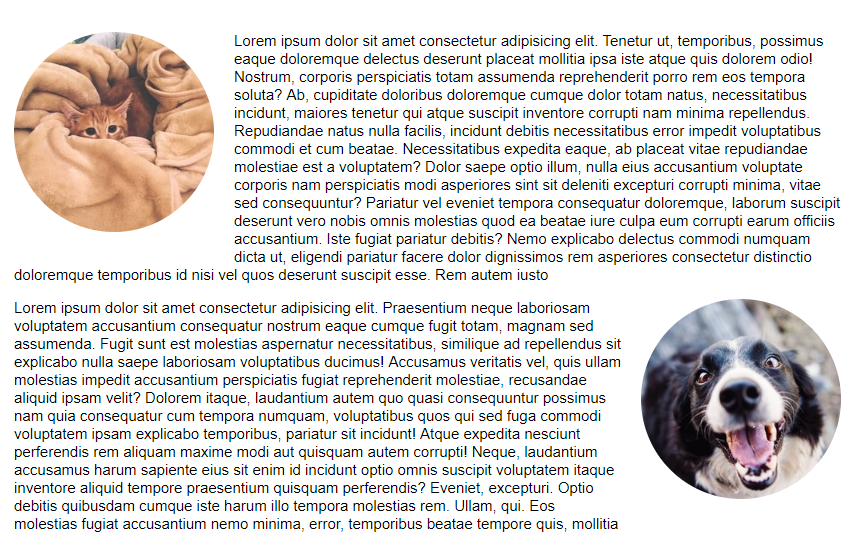
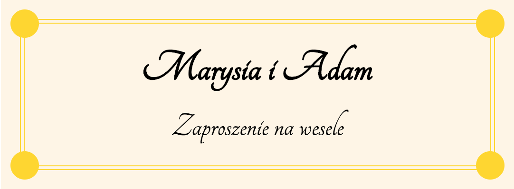
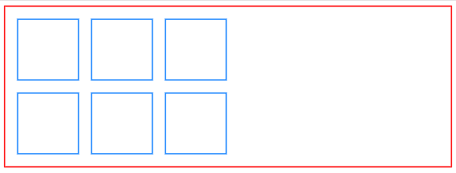
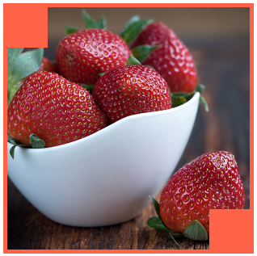
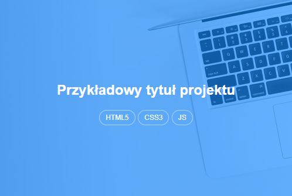

# CSS - Pozycjonowanie elementów

## Zadania rozwiązywane z wykładowcą

### Zadanie 0a

> Zadanie wykonuj w plikach:  
> `index0a.html`  
> `css/style0a.css` 

Nie ruszając HTML za pomocą float i dodatkowych właściwości ustaw elementy:

W pierwszym paragrafie:
- zdjęcie powinno być ustawione po **lewej** stronie
- powinno być odsunięte od tekstu **20px** z prawej strony i dołu
- powinno być **zaokrąglone**
- powinno mieć rozmiar **200x200px**

W drugim paragrafie:
- zdjęcie powinno być ustawione po **prawej** stronie
- powinno być odsunięte od tekstu **20px** z lewej strony i dołu
- powinno być **zaokrąglone**
- powinno mieć rozmiar **200x200px**

Poniższa grafika przedstawia końcowy efekt:

---

### Zadanie 0b

> Zadanie wykonuj w plikach:  
> `index0b.html`  
> `css/style0b.css` 

W pliku index.html znajduje się element o klasie **.card**. Jest to przykładowe zaproszenie na wesele. Znajdują się w nim 4 spany: **.dot--top-left**, **.dot--top-right**, **.dot--bottom-left** i **.fot--bottom-right**.
Ostyluj je zgodnie z nazwami klas. Każda kropka powinna mieć:

- tło koloru **gold**,
- szerokość i wysokość **30px**,
- okrągły kształt,
- elementy są spanami. Musisz im dać inne wyświetlanie (np. block),
- powinny mieć pozycjonowanie absolutne,
- kolejne kropki powinny być ustawione w odpowiednich narożnikach. Np. **.dot--left-top** powinien mieć pozycję **top: -15px**, i **left: -15px**

Wszystkie kropki powinny być pozycjonowane względem elementu **.card__border**.

Oczekiwany rezultat:

## Zadania do samodzielnego wykonania

### Zadanie 1

> Zadanie wykonuj w plikach:  
> `index01.html`  
> `css/style01.css` 

W pliku `index01.html` znajduje się strona z kontenerem **.container**.
Wstaw do niej 6 elementów o klasie **.element**.

Każdy z elementów powinien:
- układać się jeden obok drugiego (`float`)
- odstęp z każdej strony **10px**
- obramowanie **2px solid dodgerblue**
- wymiary **100x100px**

W tej chwili powinieneś mieć 6 kwadratów jeden obok drugiego.

Za pomocą pojedynczej właściwości spraw by 3 ostatnie kwadraty znalazły się pod 3 pierwszymi.

Zauważ również, że `container` stracił poprawną wysokość. Napraw to.

Oczekiwany rezultat:

---

### Zadanie 2

> Zadanie wykonuj w plikach:  
> `index02.html`  
> `css/style02.css` 

W pliku `index02.html` znajduje się element **.image**. Wykorzystując pseudoelementy ostyluj ten element tak jak na poniższej grafice. 

Pseudoelementy powinny mieć rozmiar 50x50px oraz kolor tła tomato.
Obramowanie samego elementu **.image** ma powinno mieć szerokość 5px i kolor tomato.

---

### Zadanie 3

> Zadanie wykonuj w plikach:  
> `index03.html`  
> `css/style03.css` 

W pliku `index03.html` znajduje się przykładowy kod miniaturki z projektem.
Korzystając z poznanej do tej pory wiedzy spróbuj nadać mu wygląd taki jak na poniższej grafice:

Niebieska nakładka powinna być pozycjonowana absolutnie i mieć kolor tła **rgba(0, 128, 255, 0.5)**, ale możesz nadać mu dowolne (tak by ładnie wyglądało!)
