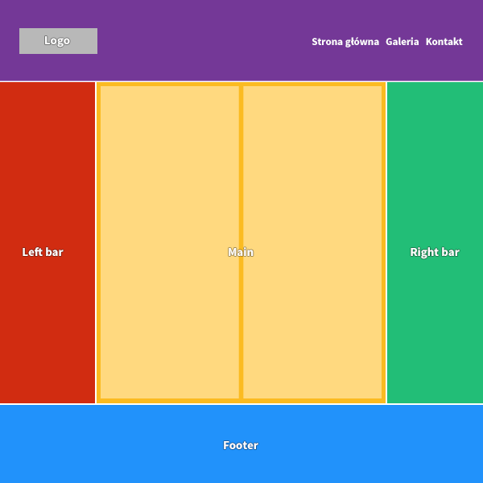
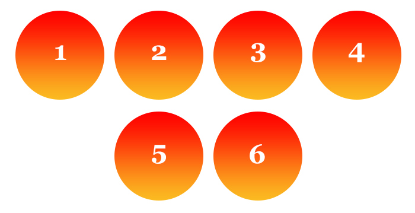

# CSS - Flexbox

## Zadania rozwiązywane z wykładowcą

### Zadanie 0a

> Zadanie wykonuj w plikach:  
> `index0a.html`  
> `css/style0a.css` 

Przy pomocy flexboxa stwórz poniższy element na stronie internetowej:

Wytyczne:

* Obrazek jest wycentrowany pionowo względem tekstu
* Przycisk `Wyślij wiadomość` znajduje się w prawym dolnym rogu boksa (użyj flexboxa).

---

### Zadanie 0b

> Zadanie wykonuj w plikach:  
> `index0b.html`  
> `css/style0b.css` 

Holy Grail w CSS to nie słynny kielich tylko problem, który w przeszłości przysparzał zmarszczek nie jednemu developerowi.

Problem ten polegał na stworzeniu w pełni działającego layoutu, który opierał by się o równe kolumny.

Wykonanie takiego layoutu za pomocą floatów było nie lada wyzwaniem i pokazywało, czy dana osoba osiągnęła prawdziwy poziom Jedi w css.

Twoim celem będzie zrobienie poniższego layoutu (bez napisów określających elementy) za pomocą flexboxa:

## Zadania do samodzielnego wykonania

### Zadanie 1

> Zadanie wykonuj w plikach:  
> `index01.html`  
> `css/style01.css` 

Korzystając z wiedzy dotyczącej jak układać elementy na stronie wykonaj poniższy układ strony.

Wytyczne:

* Do ustawiania elementów obok siebie użyj flexboxa
* Logo i nawigacja muszą być rozstrzelone (czyli być maksymalnie oddalone od siebie)
* Logo i nawigacja muszą być na środku headera (wyśrodkowane w pionie)

Dodatkowe informacje:

* kolor tła: #E53C3D
* kolor tekstu: #492F41

---

### Zadanie 2

> Zadanie wykonuj w plikach:  
> `index02.html`  
> `css/style02.css` 

Stwórz poniższą sekcję przy użyciu flexboxa:

---

### Zadanie 3

> Zadanie wykonuj w plikach:  
> `index03.html`  
> `css/style03.css` 

Kolejnym zadaniem będzie odwzorowanie poniższej grafiki:

Stwórz w html element `.circles` (np. section), w którym umieścisz 6 kółek (np. jako divy).
Każde kółko powinno mieć:

- rozmiar `150x150`
- wycentrowany w pionie i poziomie tekst (za pomocą flexboxa) o wielkości `40px`
- odstęp od innych kółek `10px`
- tło gradientowe przechodzące z czerwonego na kolor `#FBB921`

**Kółka powinny być wycentrowane w poziomie i zawijać się (spadać jedno pod drugie) jeżeli nie mieszczą się w poziomie.**