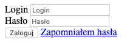
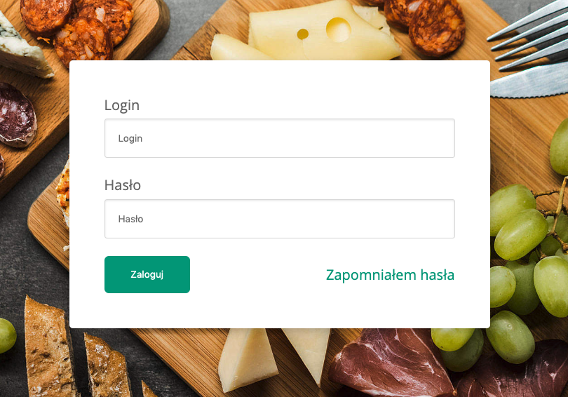

# CSS - Stylowanie formularzy

## Zadania rozwiązywane z wykładowcą

### Zadanie 0a

> Zadanie wykonuj w pliku:  
> `index.html`  

Utwórz formularz, w którym znajdą się następujące pola:
* Login
  * Placeholder "Login"
  * Label "Login"
  * Type "text"
* Hasło
  * Placeholder "Hasło"
  * Label "Hasło"
  * Type "password"
* Przycisk "Zaloguj"
  * Button
  * Type "submit"
* Link "Zapomniałem hasła"

Do formularza nie dodawaj żadnych styli!

Oczekiwany rezultat:  

## Zadania do samodzielnego wykonania

### Zadanie 1

> Zadanie wykonuj w plikach:  
> `index.html`  
> `css/style.css` 

Twoim celem będzie nadanie formualrzowi wyglądu jaki pokazuje poniższa grafika:

**Możesz dodać sobie do stworzonej wcześniej struktury odpowiednie klasy, aby ułatwić sobie stylowanie całości!**

#### Część 1
Zacznij od tła i wycentrowania formularza.

Nadaj dla elementu `body` następujące właściwości:
- tło to obrazek, który znajduje się w katalogu `images/background.jpg``
- wielkość tła taka, by zakrywała **całą powierzchnię**
- tło **wycentrowane**
- tło **nie powinno się powtarzać**

Dodatkowo spraw, by formularz na stronie był wycentrowany. Dla body nadaj flexa i wycentruj zawartość body w 2 osiach.

---

#### Część 2

Kolejnym elementem będzie formularz. Nadaj mu właściwości:

- tło koloru białego,
- zaokrąglenie rogów **4px**
- cień **0 3px 10px rgba(0, 0, 0, 0.2)**
- wewnętrzny odstęp od krawędzi **40px**

---

#### Część 3

Popraw teraz inputy, nadając im właściwości:

- wewnętrzny odstęp **15px**
- obramowanie grubości **1px**, typu **solid** o kolorze **#ddd**
- zaokrąglenie rogów **3px**
- cień **wewnętrzny** **0 1px 2px rgba(0, 0, 0, .1)**
- display na **block**
- szerokość na **400px**
- za pomocą właściwości box-sizing spraw, by padding nie rozszerzał elementu (ponieważ powyżej nadałeś mu 100%)

---

#### Część 4

Kolejnym elementem będzie przycisk logowania.

Dla elementu `button` dodaj następujące właściwości:

- kolor tła na **#05A081**
- wewnętrzny odstęp na **15px 30px**
- wyświetlanie na **inline-block**
- kolor tekstu na **biały**
- brak bordera
- zaokrąglenie rogów **5px**

---

#### Część 5

Ostatnia rzecz, jaką się zajmiesz, będzie ułożenie linka "zapomniałem hasła" po drugiej stronie formularza.

Dla ostatniego rzędzu dodaj wyświetlanie **flex**, a następnie:
- w głównej osi rozrzuć elementy po dwóch końcach tej osi
- w osi dodatkowej (pionowej) wycentruj elementy

---

**Po wykonaniu zadań dodaj dodatkowe style, by nasz formularz wyglądał jeszcze lepiej!**

np. krój fonta, ustawienie elementów itp.