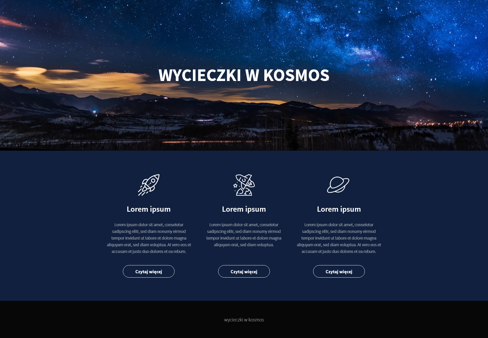
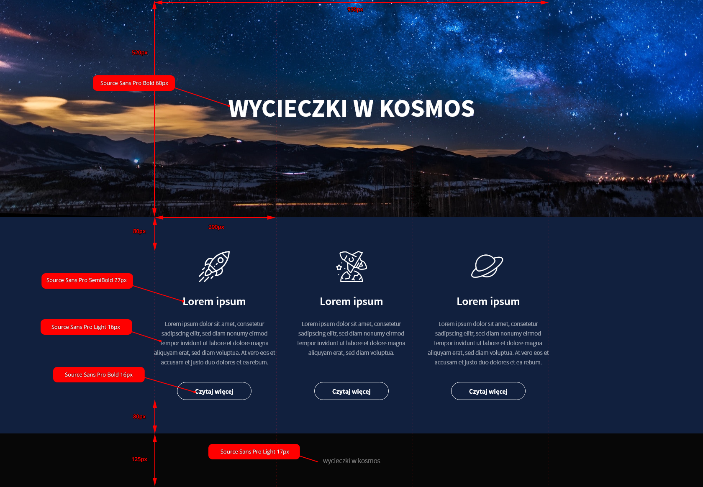

# CSS - Tworzenie układu strony

## Zadania rozwiązywane z wykładowcą

### Zadanie 0a 

> Zadanie wykonuj w plikach:  
> `index0a.html`  
> `css/style0a.css`  

**Treść do tego zadania, znajduje się w prezentacji "Zaawansowany HTML i CSS / Dzień 3 / Tworzenie układu strony".**

## Zadania do samodzielnego wykonania

### Zadanie 1

> Zadanie wykonuj w plikach:  
> `index01.html`  
> `css/style01.css`

Poniżej masz widok layoutu, który masz do przygotowania:

Poniższa grafika pokazuje pomocne informacje dotyczące projektu:

**Informacje o layoucie:**
- W projekcie użyty jest Source Sans Pro, który możesz znaleźć na [Google Fonts](https://fonts.google.com/specimen/Source+Sans+Pro)
- Tło strony zajmuje pełną szerokość, natomiast szerokość treści to `930px`
- Ikony nad tekstami znajdują się w katalogu `images/task01`
- Grafika użyta w banerze to `bg.jpg` znajdująca sie w katalogu `images/task01`
- Kolor tła strony to `#11203E`
