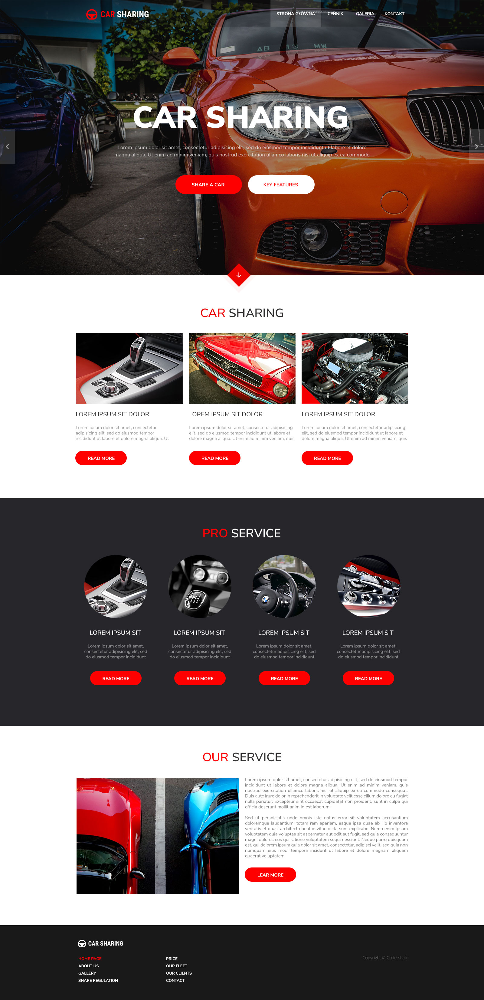

# CSS - Podsumowanie

## Zadania do samodzielnego wykonania

> Zadanie wykonuj w plikach:  
> `index.html`  
> `css/style.css`

W ramach podsumowania zdobytej wiedzy, możesz zmierzyć się z poniższym layoutem.

Przy pracy tej nie będzie specjalnych wytycznych. To w Twojej gestii jest stworzenie tego layoutu jak najlepiej - tak by “klient” był zadowolony. Liczy się efekt końcowy.

Do stworzenia jest strona o samochodach.

**Wytyczne do projektu:**
- wszystkie grafiki znajdują się w katalogu `images`
- szerokośc treści strony to `1096px`
- użyty na stronie font to `Nunito Sans` dostępny na Google Fonts
