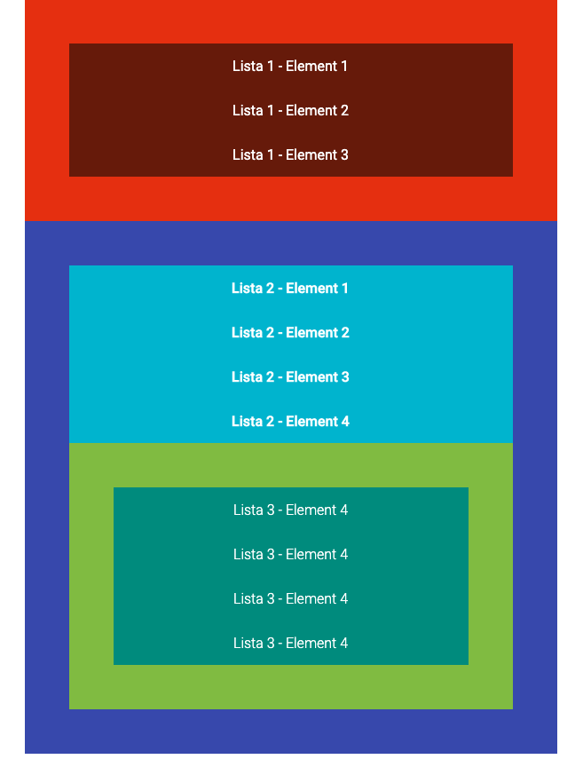

# Dzień 1 - zadania domowe

### Zadanie 1

> Zadanie wykonuj w plikach:  
> `index01.html`  
> `css/style01.css` 

W pliku `index01.html` znajduje się gotowy kod. 

**Nie należy zmieniać kodu HTML. Modyfikuj tylko kod CSS!**
 
 Ostyluj go według podanych wytycznych:

* Dołącz do strony font [Roboto](https://fonts.google.com/specimen/Roboto). Z wyżej wymienionej rodziny czcionek podłącz następujące:
    * Regular
    * Bold
    * Light
* Ustaw **wszystkim listom** odstęp wewnętrzny na `50px`
* Dla każdego tekstu w każdym elemencie listy ustaw wysokość linii na ```50px``` oraz wagę fontu na ```300```. Dodatkowo wyśrodkuj ten tekst,

* Pierwszej liście ustaw kolor tła `#e8370e` a jej elementom kolor tła `#711c08`,

* Drugiej liście ustaw kolor tła `#3f51b5` a jej elementom kolor tła `#00bcd4`,

* Trzeciej liście ustaw kolor tła `#8bc34a` a jej elementom kolor tła `#009688`,

* Ustaw dla całego dokumentu biały kolor fonta,
* Pierwszej liście ustaw wagę fonta na ```400```,
* Drugiej liście ustaw wagę fonta na ```700```,
* Trzeciej liście ustaw wagę fonta na ```300```.


Oczekiwany rezultat:
