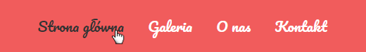
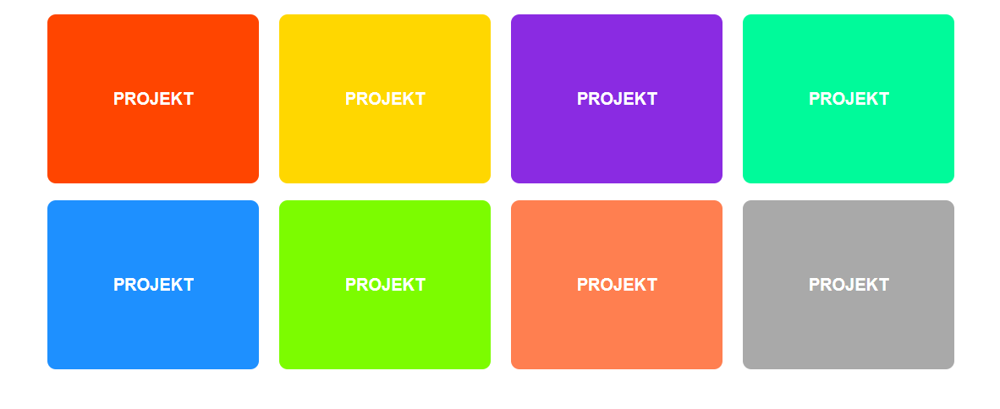
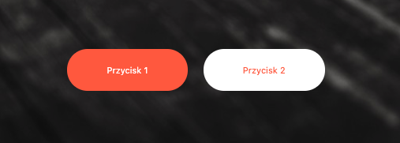

# Dzień 2 - zadania domowe

### Zadanie 1

> Zadanie wykonuj w plikach:  
> `index01.html`  
> `css/style01.css` 

W pliku HTML znajduje się przykładowy kod menu. Twoim zadaniem będzie takie jego ostylowanie, aby wyglądało jak na poniższej grafice:

 
Wytyczne dla menu:
- kolor tła menu to **#F15C5C**,
- menu ma krój "Pacyfico" o wielkości **20px**. Font ten można pobrać z Google fonts.
- odstęp między elementami menu wynosi 20px
- odstęp wewnętrzny menu wynosi 20px
- menu nie powinno mieć odstępu zewnętrznego
- po najechaniu na link, zmienia się jego kolor na **#333**
- elementy ustaw obok siebie za pomocą `flex`

---

### Zadanie 2

> Zadanie wykonuj w plikach:  
> `index02.html`  
> `css/style02.css` 

W pliku `index02.html` znajduje się prosty kod baneru. Twoim celem będzie takie jego ostylowanie by wyglądał jak na poniższej grafice:

Wytyczne dla baneru:
- wysokość `600px`,
- tło baneru to grafika leżąca w katalogu **images/car-background.jpg**,
- któj tekstu to **Oswald**, który można znaleźć na Google fonts.
- wielkość tekstu to `60px`, a grubość `600`
- kolor słowa "Sharing" `orangered`
- tekst ma być wycentrowany w obu osiach przy użyciu `flex`

Grafika tła po stworzeniu banera jest zbyt jasna, potrzebne jest jej przyciemnienie. Aby temu zaradzić dodaj dla banneru pseudoelement `::before`. Element taki powinien być pozycjonowany **absolutnie** i przykrywać całą powierzchnię baneru. Dodatkowo powinien mieć tło koloru **#111** i przezroczystość **0.5**.
Element taki przykryje tekst. Spróbuj tekst wynieść na wierzch.

---

### Zadanie 3

> Zadanie wykonuj w plikach:  
> `index03.html`  
> `css/style03.css` 

W pliku `index03.html` znajduje się przykładowy kod mini galerii z projektami. 
Twoim celem będzie nadanie jej wyglądu jak na poniższej grafice:

Wytyczne do zadania:
- elementy mają wymiary `250x200`,
- elementy mają zaokrąglenie narożników o wielkości `10px`
- tekst w elementach pisany jest krojem `sans-serif` o wielkości `20px` i kolorze białym.
- jeżeli mają na tyle miejsca, powinny wyświetlić się obok siebie. Jeżeli będziemy zmniejszać okno przeglądarki, powinny spadać do kolejnych rzędów

Kolory kolejnych elementów to:
- orangered
- gold
- blueviolet
- mediumspringgreen
- dodgerblue
- lawngreen
- coral
- darkgray

---

### Zadanie 4

> Zadanie wykonuj w plikach:  
> `index04.html`   
> `css/style04.css` 
 
Na stronie znajdują się 2 przyciski. Twoim zadaniem będzie ostylowanie ich jak na poniższej grafice:
 

Wytyczne do stylowania:

- przyciski nie powinny mieć pobramowania,
- przyciski powinny mieć kursor łapkę,
- odstęp wewnętrzny przycisków wynosi `20px` z góry i dołu oraz `50px` z lewej i prawej strony,
- zaokrąglenie rogów to `35px`,
- czerwony kolor użyty w przyciskach to **tomato**
- odstęp między przyciskami powinien wynosić minimum **10px**