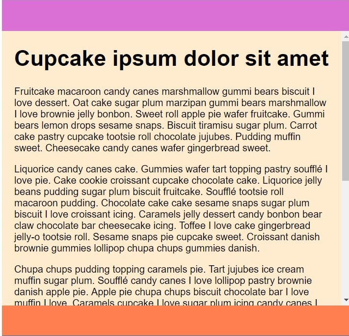

# Sass & RWD - zadania domowe
> Kod wpisz w odpowiednim pliku, zgodnie z poleceniem zadania.
BARDZO WAŻNE - Wasze zadania są sprawdzane przy pomocy automatycznego systemu. Żeby odpowiedzi zostały uznane za poprawne, strony MUSZĄ wyświetlać te same komunikaty co w treści zadania, a funkcje i metody MUSZĄ posiadać nazwy dokładnie takie same jak podane w zadaniu.

### Dzień 3 - RWD część 2
> Zadania z tego dnia wykonuj w pliku main.scss oraz index.html. Wygeneruj odpowiedni plik .css do folderu css
Dołącz plik .gitignore (uwzględniając w nim node_modules)

#### Zadanie 1. Flexbox &ndash; layout
W pliku `index.html` znajdziesz sekcję o nazwie `hoily-grail`.
Za pomocą flexboxa stwórz szablon strony na podstawie layoutu niżej:

#### Zadanie 2. Flexbox. Właściwość flex-shrink
> Należy wykonać w innej przeglądarce niż Chrome

W pliku `index.html` znajdziesz sekcję o nazwie `flex-container`.

* dodaj do jej klasy właściwość display: flex oraz ustaw tło. Niech kierunek flexa będzie poziomy.
* następnie dodaj wewnątrz kontenera kilka zdjęć obok siebie o łącznej szerokości, co najmniej 500px, ale nie większej niż 1024px – niech wymiary zdjęć będą takie same.
* ustaw zdjęcia tak, by były wyśrodkowane względem wysokości kontenera
* dodaj odpowiednie właściwości kontenerowi i zdjęciom, tak aby przy zmniejszaniu rozmiaru okna przeglądarki, zdjęcia się nie kurczyły, tylko przewijały
* niezbędne będzie wykorzystanie właściwości `overflow`

#### Zadanie 3. Flexbox. Właściwość flex-grow i flex-shrink
> Włącz widok responsywny przeglądarki i ustaw okno na szerokość mobilną

W pliku `index.html` znajdziesz sekcję o nazwie `flex-container-column`.

* dodaj do jej klasy właściwość display: flex o orientacji pionowej oraz ustaw height: 100vh
* dodaj do kontenera trzy sekcje: header, main oraz footer. Niech każda z nich posiada kolorowe tło.
* określ dowolną wysokość dla headera i footera
* w sekcji main wrzuć kilka paragrafów
* przy pomocy właściwości flex-boxa ustaw header i footer tak, aby zawsze były widoczne w oknie przeglądarki – były przyklejone odpowiednio do góry i dołu okna
* dodaj odpowiednie właściwości aby przy zmniejszaniu wysokości okna przeglądarki, tekst w środkowej sekcji był przewijalny
* niezbędne będzie wykorzystanie właściwości `overflow`

