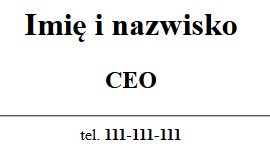

# Dzień 2 - zadania domowe

## Przygotowanie
> Zmodyfikuj plik `webpack.config.js` tak aby:
> - zmienna `entryPath` wskazywała na `3_Zadania_domowe/Dzien_2`
> - zmienna `entryFile` wskazywała na plik, nad którym aktualnie pracujesz, np. `task01.js`
>
> **Pamiętaj aby po każdej zmianie w pliku `webpack.config.js` przerwać działanie Webpacka (`CTRL+C`) a następnie włączyć go z powrotem (`npm start`).**

---

### Zadanie 1

Stwórz komponent o nazwie `RandomNumbers`. Do `props` 
przyjmuje wartości `min`, `max` i `count`. 
Generuje on do tablicy tyle liczb pseudolosowych z zakresu 
`min` i `max`, ile podano w `count`.

Następnie stwórz komponent `RandomNumbersInfo`, 
który będzie wyświetlał w elemencie `div` informację o zadanym 
minimum, maksimum i ilości liczb (przez `props` z komponentu 
`RandomNumbers`).

Ostatnim komponentem będzie `RandomNumbersList`, 
który ma wyświetlać wszystkie wylosowane liczby w dowolnej 
formie (lista, po przecinku).

Wyrenderuj `RandomNumbers` w komponencie `App`, podając w 
atrybutach do props przykładowe dane.

---

### Zadanie 2 - `js/task02.js`

W pliku `js/data/person.js` znajduje się obiekt reprezentujący osobę. Zaimportuj go do pliku `js/task02.js` za pomocą:

```js
import Person from './data/person';
```

Stwórz **komponent funkcyjny** `PersonBox`, a w nim następującą strukturę (postaraj się samemu wymyśleć, jakie to elementy, i wybrać podobne style):



Za pomocą React wyrenderuj w elemencie o id ```app``` komponent `PersonBox`, w którym będą się wyświetlały dane tej osoby według struktury podanej powyżej. Nazwy tych właściwości obiektu znajdziesz w importowanym pliku.

---

### Zadanie 3 - `js/task03.js`

W pliku `js/data/products.js` znajduje się tablica z produktami. Zaimportuj ją do pliku `js/task03.js` za pomocą:

```js
import Products from './data/products';
```

Stwórz **komponent klasowy** `ProductsList`. Komponent ma wyświetlać produkty, jeden pod drugim, uwzględniając: nazwę, cenę, kod produktu i przycisk "Do koszyka".

Struktura wyświetlania tych elementów zależy od Ciebie. **Pamiętaj jednak o prawidłowym wybraniu klucza!**

Lista powinna być generowana za pomocą metody `map()`.
