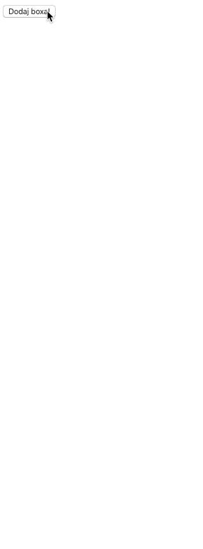

# useState

## Przygotowanie
> Zmodyfikuj plik `webpack.config.js` tak aby:
> - zmienna `entryPath` wskazywała na `1_Zadania/Dzien_2/1_useState`
> - zmienna `entryFile` wskazywała na plik, nad którym aktualnie pracujesz, np. `task01/App.js`
>
> **Pamiętaj aby po każdej zmianie w pliku `webpack.config.js` przerwać działanie Webpacka (`CTRL+C`) a następnie włączyć go z powrotem (`npm start`).**


## Zadanie rozwiązywane z wykładowcą

### Zadanie 0a 

> Pliki do pracy  
> `js/task0a/App.js`  
> `js/task0a/Counter.js`

Stwórz komponent funkcyjny `Counter`. Ma on posiadać własny stan z ustawioną wartością początkową na `10`.
 
Ma on wyrenderować:

- `h2` z napisem: "Liczba kliknięć {tutaj wstaw wartość licznika}"
- `button` "+" który ma zwiększać licznik o 1
- `button` "-" który ma zmniejszać licznik o 1
- `button` "Reset" - który ma przywracać wartość licznika do początkowej (10)

Pamiętaj aby zbudować także główny komponent `App`, a w nim wykorzystywać komponenty budowane w ćwiczeniach. Renderuj na stronie główny komponent `App`.

---

### Zadanie 0b

> Pliki do pracy  
> `js/task0b/App.js`  
> `js/task0b/ColorfulBoxes.js`

Stwórz komponent funkcyjny `ColorfulBoxes`. Stan początkowy komponentu powinien być pustą tablicą.

Komponent ma renderować:

- Przycisk "Dodaj Boxa!"
- Boksy (`divy` o rozmiarach `200x200`) wygenerowane na podstawie tablicy w stanie komponentu

Przycisk "Dodaj Boxa!" ma dodawać do tablicy w stanie komponentu losowo wygenerowany kolor. Każdy box wyrenderowany na podstawie tej tablicy powinien mieć `backgroundColor` nastawiony na odpowiadający mu wpis z tablicy.

Przykład:  
;

---

### Zadanie 0c

> Pliki do pracy  
> `js/task0c/App.js`  
> `js/task0c/CountThings.js`

Stwórz komponent `CountThings` który będzie miał **dwa stany początkowe**:

- stan konta w banku (na początku 10000)
- aktualny wiek użytkownika

Komponent ma renderować `div` z dwoma `p`:

- Pierwszy ma mieć napis: "💰 so much money: ${stan konta}"
- Drugi ma wyświetlać: "Age: {wiek użytkownika}"

Dodatkowo mają pojawić się dwa przyciski:

- "Get rich!" który po kliknięciu ma dodawać do stanu konta 1000
- "Get older :(" który po kliknięciu ma dodawać 1 do wieku użytkownika

## Zadania do samodzielnego wykonania

### Zadanie 1

> Pliki do pracy  
> `js/task01/App.js`  
> `js/task01/UpperLower.js`

Stwórz komponent `UpperLower` który ma posiadać w swoim stanie dowolny napis. Ma go on również wyświetlać w `h2` wraz z dwoma przyciskami:

- "Uppercase" ma przekształcić dany tekst w stanie na wielkie litery
- "Lowercase" ma przekształcić dany tekst w stanie na małe litery

Pamiętaj aby zbudować także główny komponent `App`, a w nim wykorzystywać komponenty budowane w ćwiczeniach. Renderuj na stronie główny komponent `App`.

---

### Zadanie 2

> Pliki do pracy  
> `js/task02/App.js`  
> `js/task02/Numbers.js`

#### Część 1
Stwórz komponent `Numbers` który na początek w swoim stanie będzie przechowywał tablicę składającą się z różnych liczb, np.:

```plain
[54,76,24,63,4,54,82,36,13,80,10,69,4,23,40]
```

Komponent ten ma renderować wszystkie te wartości w formacie listy `ul` a także przycisk "Pokaż tylko parzyste". Po jego kliknięciu, należy przefiltrować tablicę liczb i zapisać do stanu tablicę składającą się tylko z wartości parzystych.


#### Część 2

Zmodyfikuj to zadanie dodając dwa dodatkowe przyciski: 

- "Pokaż wszystkie" wyświetla wszystkie wartości (parzyste i nieparzyste)
- "Pokaż nieparzyste" wyświetla tylko wartości nieparzyste

Aby mieć dostęp do pełnej tablicy nawet po jej przefiltrowaniu, można zapisać ją do zmiennej pomocniczej **przed** inicjalizacją stanu, a następnie skorzystać z niej podczas zaczepiania stanu metodą `useState`.

--- 

### Zadanie 3

> Pliki do pracy  
> `js/task03/App.js`  
> `js/task03/ToDoList.js`

Stwórz komponent `ToDoList` który ma przechowywać w swoim stanie na początku pustą tablicę. Renderować ma przycisk "Dodaj zadanie" a także listę `ul` z zadaniami z tej tablicy.

Po kliknięciu w przycisk należy dodać do tablicy w stanie komponentu napis: "Zadanie n". Pod `n` wstaw kolejny numer zadania na podstawie ilości elementów w tablicy.
