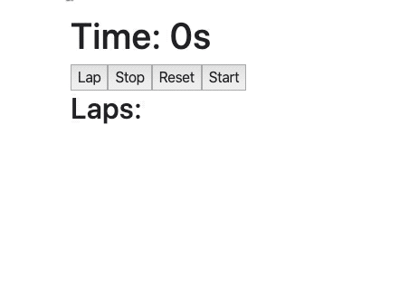

# useEffect

## Przygotowanie
> Zmodyfikuj plik `webpack.config.js` tak aby:
> - zmienna `entryPath` wskazywała na `1_Zadania/Dzien_2/2_useEffect`
> - zmienna `entryFile` wskazywała na plik, nad którym aktualnie pracujesz, np. `task01/App.js`
>
> **Pamiętaj aby po każdej zmianie w pliku `webpack.config.js` przerwać działanie Webpacka (`CTRL+C`) a następnie włączyć go z powrotem (`npm start`).**

## Zadanie rozwiązywane z wykładowcą

### Zadanie 0a 

> Pliki do pracy  
> `js/task0a/App.js`  
> `js/task0a/Box.js`

Stwórz komponent `Box` który będzie przetrzymywał w stanie swój kolor (domyślnie `cornflowerblue`). 
Renderować ma `diva` o wymiarach `100x100px` i kolorze podanym w stanie.

Po 2 sekundach kolor ma się zmienić na `tomato`.

---

### Zadanie 0b

> Pliki do pracy  
> `js/task0b/App.js`  
> `js/task0b/CustomTitle.js`

Komponent `CustomTitle` ma zawierać informacje o ilości kliknięć (początkowo 1) w element `p` na stronie. Element ten ma wyświetlać napis: "Kliknięto mnie już: {n} razy". 

Ma on również zwiększać swój `font-size` razem z liczbą kliknięć według wzoru: `n * 1.2rem`.

Dodatkowo, ilość kliknięć ma się wyświetlać w tytule strony (obiekt `document`). Wykorzystaj do tego `useEffect`.

## Zadania do samodzielnego wykonania

### Zadanie 1

> Pliki do pracy  
> `js/task01/App.js`  
> `js/task01/UserInfo.js`

Stwórz komponent `UserInfo` który ma posiadać w swoim stanie obiekt składający się z imienia i nazwiska.

**Po zamontowaniu komponentu** należy zmienić to imię i nazwisko na dowolne inne.

Pamiętaj o tym aby zrobić to w odpowiednim miejscu, tak by nie doszło do nieskończonego renderowania komponentu.

Wyświetl to imię i nazwisko ze stanu komponentu w elemencie `p`.

---

### Zadanie 2

> Pliki do pracy  
> `js/task02/App.js`  
> `js/task02/Clock.js`  
> `js/task02/ClockTime.js`  
> `js/task02/ClockDate.js`

Jest to powtórzenie zadania z dnia wczorajszego. Teraz zróbcie je wspólnie używając tylko komponentów funkcyjnych.

Stwórz komponent `Clock`, który przechowuje w `state` aktualną datę.

Dodaj do swojego komponentu `interval`, który co 1 sekundę aktualizuje datę w state na aktualną. Pamiętaj aby zrobić to w odpowiedniej metodzie oraz aby zwolnić zasoby.

Stwórz dwa sub komponenty:

1. `ClockTime` - przyjmuje przez props datę (`date`) i wyświetla samą godzinę w elemencie h1 za pomocą `Date.toLocaleTimeString()`.

2. `ClockDate` - przyjmuje przez props datę (`date`) i wyświetla samą datę w elemencie h1 za pomocą `Date.toLocaleDateString()`.

Główny komponent - `Clock` renderuje odpowiednio dwa sub komponenty przekazując im aktualną datę ze swojego state.

Pamiętaj aby zbudować także główny komponent `App`, a w nim wykorzystywać komponenty budowane w ćwiczeniach. Renderuj na stronie główny komponent `App`.

---

### Zadanie 3

> Pliki do pracy  
> `js/task03/App.js`  
> `js/task03/Stopwatch.js`

Stwórz komponent `Stopwatch`. Jego zadaniem będzie odmierzanie czasu. Komponent powinien w swoim stanie przetrzymywać:

- czas stopera (`time`)
- ID interwału (`intervalId`)
- listę okrążeń (`laps`)

Ma on renderować:

- `h1` z napisem "Time: {time}s"
- 4 przyciski
  - "Lap" 
  - "Stop"
  - "Restart"
  - "Start"
- listę `ul` z wyświetloną tablicą `laps`

Zaraz po uruchomieniu komponentu, stoper powinien zacząć odliczać sekundy w górę.
Po kliknięciu przycisku "Stop" stoper ma się zatrzymać. Po wciśnięciu "Start" rozpocząć dalsze odliczanie od miejsca w którym został zatrzymany.

Kiedy stoper jest aktywny, przycisk "Lap" ma dodawać aktualny czas do tablicy `laps`.

"Restart" ma kończyć działanie stopera i resetować interwał, czas i tablicę okrążeń. 
  
Przykład:    
  

